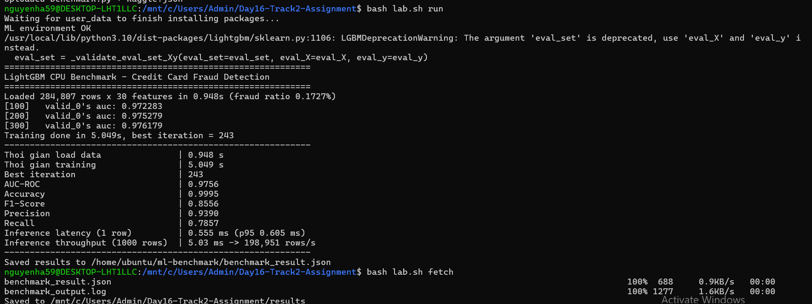
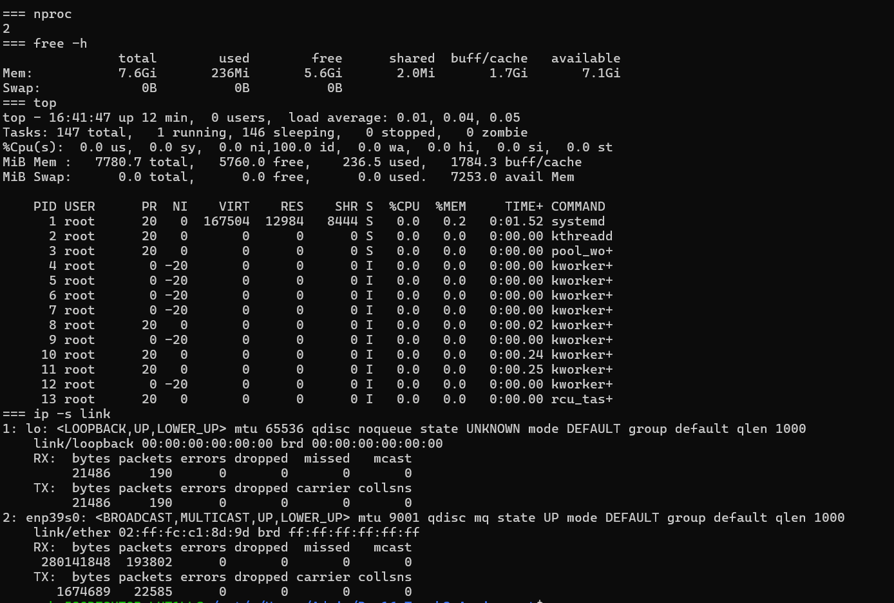

# Lab 16 — Báo cáo: LightGBM trên AWS CPU Node

## Môi trường triển khai

| Thành phần | Giá trị |
|---|---|
| Region | `ap-southeast-2` (Sydney) — SCP của AWS Organization chặn `us-east-1` |
| Compute Node | `m7i-flex.large` (2 vCPU / 8 GB RAM) — tài khoản gói Free không cho chạy `t3.medium` |
| Bastion | `t3.micro` (public subnet), Compute Node nằm trong private subnet, ra internet qua NAT Gateway |
| Phần mềm | Ubuntu 22.04, Python 3.10.12, LightGBM 4.7.0 |
| Dataset | Kaggle `mlg-ulb/creditcardfraud` — 284,807 dòng × 30 features, tỷ lệ gian lận 0.1727% |
| Chia dữ liệu | Train 199,364 / Validation 28,481 (early stopping) / Test 56,962 — stratified |

## Kết quả benchmark

| Metric | Kết quả |
|---|---|
| Thời gian load data | 0.948 s |
| Thời gian training | 5.049 s |
| Best iteration | 243 |
| AUC-ROC | 0.9756 |
| Accuracy | 0.9995 |
| F1-Score | 0.8556 |
| Precision | 0.9390 |
| Recall | 0.7857 |
| Inference latency (1 row) | 0.555 ms (p95 0.605 ms) |
| Inference throughput (1000 rows) | 5.03 ms → ~198,950 rows/s |

Chi tiết: [`results/benchmark_result.json`](results/benchmark_result.json), log: [`results/benchmark_output.log`](results/benchmark_output.log).

### Output `python3 benchmark.py` trên Compute Node

### Tài nguyên Compute Node (CPU / RAM / Network)

`nproc`, `free -h`, `top`, `ip -s link` chụp ngay sau khi chạy benchmark (training chỉ ~5 s nên CPU đã về trạng thái rảnh):

## Nhận xét

1. **Training time:** chỉ ~5 giây cho ~200k dòng trên 2 vCPU — LightGBM (histogram-based gradient boosting) rất hiệu quả trên CPU, bài toán dữ liệu bảng cỡ này hoàn toàn không cần GPU.
2. **AUC-ROC 0.976:** mô hình phân biệt tốt giao dịch gian lận/hợp lệ. Accuracy 99.95% **không có ý nghĩa** vì dữ liệu lệch nặng (đoán "hợp lệ" cho tất cả cũng đạt 99.83%), nên cần nhìn AUC, Precision, Recall, F1.
3. **Precision 0.94 / Recall 0.79** (ngưỡng 0.5): trong ~98 ca gian lận ở tập test, mô hình bắt được ~77 ca, bỏ sót ~21, và chỉ báo nhầm ~5 giao dịch. Nếu ưu tiên bắt nhiều gian lận hơn có thể hạ ngưỡng để tăng Recall, đổi lại Precision giảm.
4. **Early stopping:** lần chạy đầu dùng cây lớn (63 lá, lr 0.05) dừng ở iteration 1 (AUC 0.918) do mô hình overfit ~400 mẫu gian lận ngay sau vài cây. Chuyển sang cây nhỏ có regularization (15 lá, lr 0.02, `min_child_samples=100`, `reg_lambda=5`) và early stopping chỉ theo AUC thì mô hình học ổn định tới 243 cây.
5. **Inference:** latency ~0.55 ms/dòng (chủ yếu là overhead gọi Python/pandas) và throughput ~200k dòng/s khi dự đoán theo batch — batch nhanh hơn gọi từng dòng khoảng 100 lần, đủ cho cả scoring real-time lẫn batch scoring.
6. **Tài nguyên:** RAM dùng ~250 MB / 7.6 GB khi rảnh, mạng nhận ~280 MB (dataset + pip packages). Máy 2 vCPU / 8 GB là dư cho workload này; một instance nhỏ hơn vẫn chạy được.
7. **Chi phí:** phần lớn chi phí hạ tầng đến từ NAT Gateway và ALB (tính theo giờ) chứ không phải EC2 — cần `terraform destroy` ngay sau khi làm xong.
